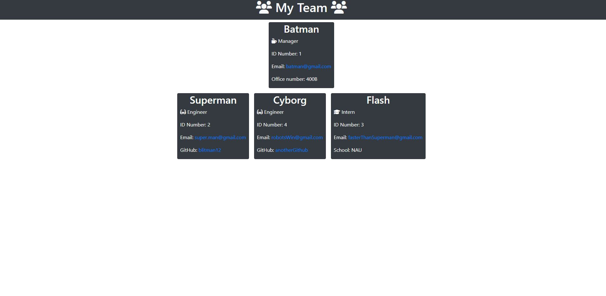

# Team Generator
 

## Description
This application was provided to create fast HTML webpages for team leaders. The team leader can input team members to display their: role, school, github and emails

## Table of Contents
* [Installation](#installation)
* [Usage](#usage)
* [Contributions](#contributions)
* [Questions](#questions)
* [Tests](#tests)

## Installation
Clone the repo. Install dependencies (node, inquirer, jest). Open terminal and run "node index" and follow the prompts.

## Usage
Run "node index" in the terminal and follow the prompts to create your own HTML Team Page.
[Video Demonstration](https://watch.screencastify.com/v/gbUuSD8OtB17BqHqTBoP)

## Contributions
Potential to add a greater span of "roles" or possibly make them dynamic.

## Questions
Please visit my [GitHub profile](https://github.com/blitman12) for other cool projects
If you have any remaining questions please feel free to reach me at bradlitman94@gmail.com

## Tests
Tests were written with Jest. Install the dependencies and run "npm run test" to see them pass/fail.
